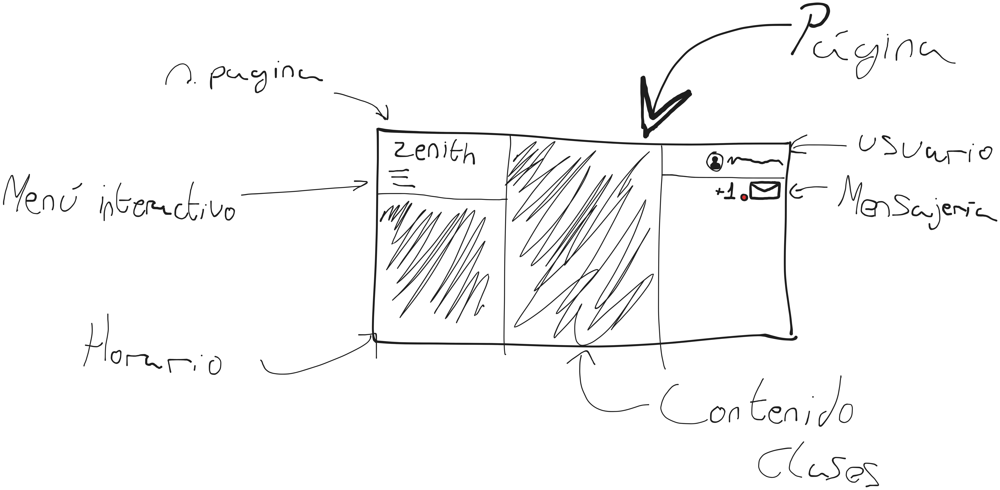

# Reto-ODS4-WebSostenible

# Informe de Misión: Optimización Educativa

## El Problema (El "Bug")

> El principal fallo, "bug" o  problema de la educación digital actual es la _**extrema lentitud y pesadez de plataformas como Moodle**_. Estos sistemas consumen una cantidad excesiva de recursos de servidor y memoria RAM, lo que excluye a estudiantes con dispositivos antiguos o conexiones a internet limitadas. Esta falta de eficiencia no solo frustra el aprendizaje, sino que dispara los costes de mantenimiento y el gasto energético de los centros educativos.

## Impacto en el ODS 4

Nuestra plataforma ayuda a cumplir el **ODS 4 (Educación de Calidad)** al eliminar las barreras técnicas. Al ser una web optimizada, garantizamos que el acceso al conocimiento sea equitativo, permitiendo que cualquier persona pueda estudiar sin importar la potencia de su hardware o la velocidad de su red.

## Sostenibilidad y Eficiencia Digital

Para asegurar que nuestra web sea sostenible y ahorre recursos, hemos implementado las siguientes medidas:

- [ ] **Arquitectura ligera:** Código simplificado para que la web cargue rápido y no sature el procesador.

- [ ] **Modo oscuro nativo:** Reducción del consumo de energía en pantallas para ahorrar batería.

- [ ] **Optimización de caché:** Menos peticiones al servidor, lo que reduce el gasto eléctrico y el tráfico de datos.

- [ ] **Compresión de archivos:** Uso de formatos de última generación para minimizar el peso de los materiales educativos.

# 🌿 Proyecto Zenith: El Futuro del E-learning Sostenible

**Nombre de la Web:** Zenith  

### 🚀 Funcionalidades Principales

1.  **Rendimiento de Alto Impacto:** Optimización extrema para lograr tiempos de carga instantáneos, reduciendo el consumo de energía del servidor y del dispositivo del usuario.

2.  **Interfaz Visual de Vanguardia:** Un diseño moderno y "llamativo" que mejora la retención del alumno y rompe con la estética anticuada de los LMS tradicionales.

3.  **Sostenibilidad Digital (Core):** Implementación de código limpio y transferencia de datos mínima para reducir drásticamente la huella de carbono por cada sesión activa.

### 📊 Entidades de Base de Datos

Para que la plataforma sea escalable y eficiente, se han definido las siguientes entidades principales:

| Entidad | Descripción | Atributos Principales |

| :--- | :--- | :--- |

| **Usuarios** | Gestiona los perfiles de alumnos y profesores. | `id`, `nombre`, `email`, `rol`, `puntos\_eco` |

| **Cursos** | Contenedor de las unidades didácticas y materiales. | `id`, `titulo`, `categoria`, `id\_profesor` |

| **Recursos** | Archivos y lecciones optimizados para bajo consumo. | `id`, `id\_curso`, `tipo\_archivo`, `peso\_kb`, `url\_cdn` |

| **Mensajes** | Sistema de comunicación interna entre usuarios. | `id`, `emisor\_id`, `receptor\_id`, `contenido`, `fecha` |

---

El diseño de \*\*Zenith\*\* se ha centrado en la usabilidad y la estética visual sin sacrificar la eficiencia energética. Se prioriza el uso de colores que consumen menos energía en pantallas modernas y una jerarquía visual clara.

### 🖼️ Prototipo de la Interfaz (Escritorio)

A continuación, se presenta la captura del diseño realizado para el navegador:

> **Nota para el equipo:** El archivo de imagen debe estar subido al repositorio en la misma carpeta que este documento para que el enlace funcione correctamente.

